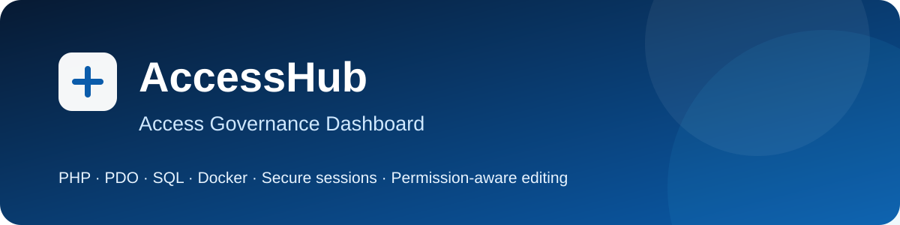
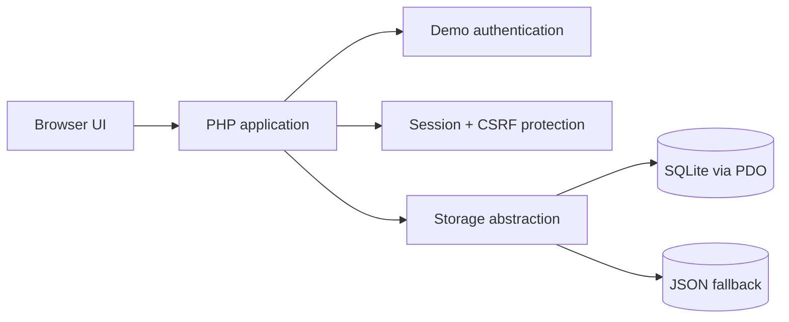

# AccessHub — Access Governance Dashboard

<p align="center"></p>

<p align="center">
  <strong>A privacy-safe portfolio demo for exploring access groups, job roles, owners and approvers.</strong>
</p>

<p align="center">
  
  
  
  
  
</p>

## Overview

AccessHub makes access responsibilities easier to understand. Users can browse fictional groups and job roles, see their owners and approvers, search and filter records, and maintain descriptions when they have the required responsibility.

The public repository is an **independently rewritten demonstration**. It preserves the product idea and interaction flow of an internal prototype while excluding employer source code, production integrations, branding and company data.

## Features

- searchable group and job-role directory;
- owner and approver visualization;
- permission-based description editing;
- server-side authorization checks before updates;
- prepared SQL statements through PDO;
- audit trail and CSV export;
- responsive light and dark themes;
- CSRF protection and hardened PHP sessions;
- SQLite persistence with a dependency-free JSON fallback;
- Docker setup and automated smoke tests.

## Production concept vs. public demo

| Area | Original production concept | Public portfolio demo |
|---|---|---|
| Authentication | LDAPS / Active Directory | Local fictional demo accounts |
| Data source | Remote MySQL-compatible database | Local SQLite via PDO, JSON fallback |
| SQL | Production queries and permission checks | Representative `SELECT`, `INSERT` and `UPDATE` statements |
| Data | Internal access records | Fully synthetic records |
| Purpose | Internal operational tool | Portable technical demonstration |

This distinction is intentional: the repository demonstrates the architecture and engineering decisions without publishing confidential information or proprietary implementation details. See [Production vs. demo](docs/PRODUCTION_VS_DEMO.md) for more context.

## Architecture



More details are available in [Architecture](docs/ARCHITECTURE.md).

## Run locally

### Docker Desktop

```bash
docker compose up --build
```

Open **http://localhost:8080**.

### PHP 8.2+

Windows:

```text
START_HERE.cmd
```

macOS / Linux:

```bash
./start-mac-linux.sh
```

## Demo accounts

All demo accounts use the password `demo123`.

| Account | Permission model |
|---|---|
| `altan@example.test` | Owner and approver |
| `sara@example.test` | Approver |
| `viewer@example.test` | Read-only |

## Tests

```bash
php tests/smoke.php
```

The GitHub Actions workflow also validates PHP syntax and runs the smoke tests on pushes and pull requests.

## Privacy and ownership

- no employer source code;
- no production database export;
- no internal hostname, URL or certificate;
- no Active Directory or LDAP credential;
- no real employee, customer or access record;
- no API key or secret.

See [SECURITY.md](SECURITY.md) for the security scope.

## License

Released under the [MIT License](LICENSE).
